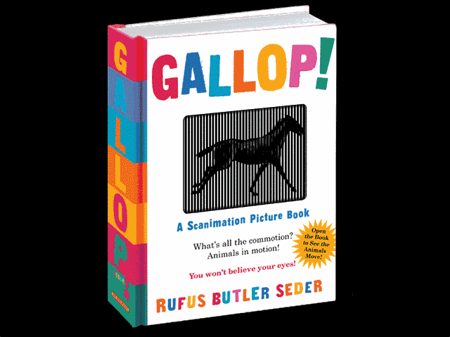
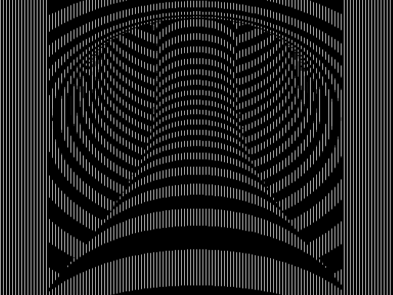

<h1 align="center"><a href="#"> </a>  Barrier Grid Animation </h1>

<h4 align="center">Experiments </h4>

<a href="#">Link</a> •
<a href="#">Link</a> •
<a href="#">Link</a> 

<a href="#"><h1 align="center">Scanimation </h1></a>

Made with:

<h3 align="center">
  </h3>

---

Resources:

<h3 align="center">Barrier-grid Animation, Scanimation  
</h1>
<h4 align="center">. </h4>

<h3 align="center">Phenakistiscope  
</h1>
<h4 align="center">The Phenakistiscope is one of the first forms of moving media entertainment </h4>

---
